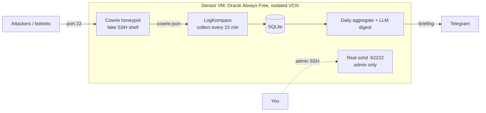
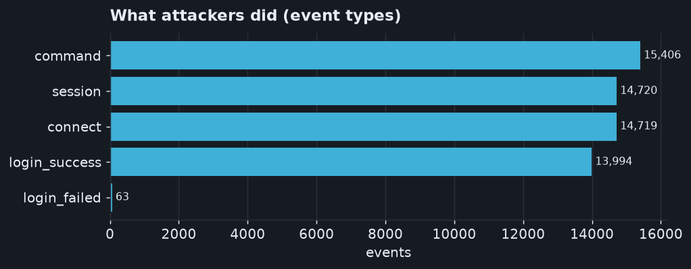
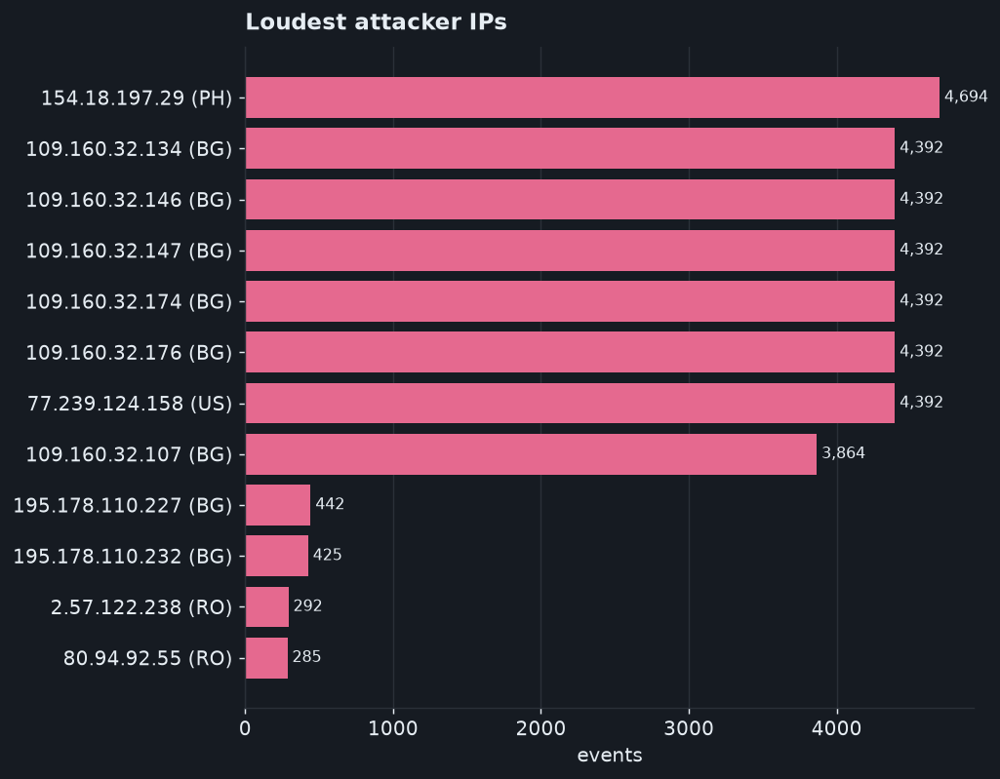
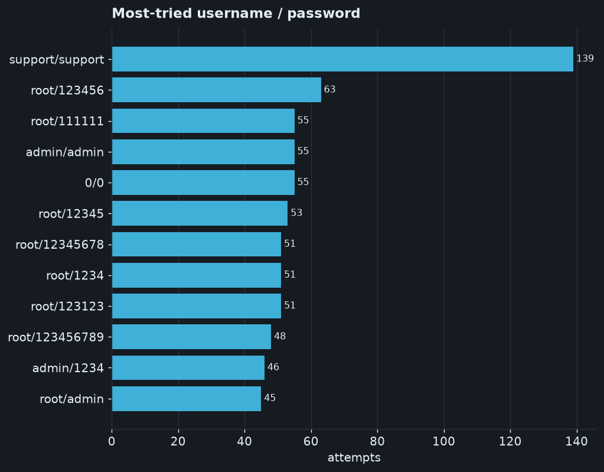
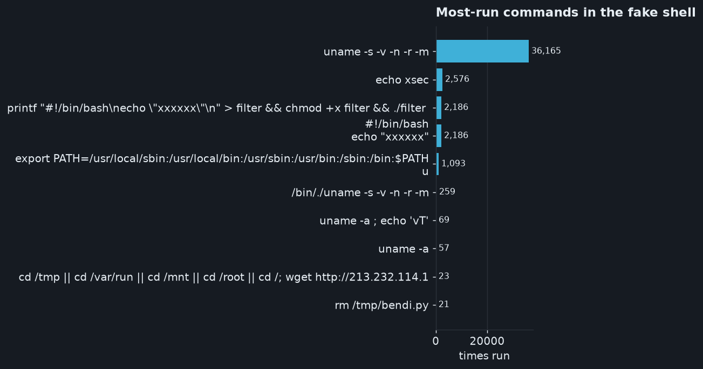

# Running LogKompass as a live SSH honeypot

LogKompass started as an SSH auth-log triage tool for a single quiet server. This
document is about the more interesting thing it became: the front end of a real
**SSH honeypot sensor** that sits on the public internet, lets attackers "in" to a
fake shell, and turns what they do into a daily plain-English briefing.

> **TL;DR** — a disposable VM answers port 22 with [Cowrie](https://github.com/cowrie/cowrie)
> (a fake SSH server). LogKompass ingests Cowrie's events — including the
> **passwords tried and the commands run** — enriches and stores them, and a free
> LLM writes a short daily summary to Telegram. Real admin access stays on a
> separate high port, on a separate network, so the trap can never endanger anything.

## Why a honeypot?

A hardened server hides SSH on a non-standard port, so it sees almost no attacks —
the logs are empty and there is nothing to triage. That is good security but a
boring dataset. Internet-wide credential-stuffing overwhelmingly targets **port 22**.
So instead of hiding, we expose an *intentional* port 22 on a throwaway machine and
record the flood. The premise held: the sensor logged real attackers within minutes
of going live.

## Architecture



- **Port 22 → Cowrie.** An `iptables` redirect sends public `:22` to Cowrie on
  `:2222`. Attackers get a convincing emulated shell and never touch a real OS.
- **Admin SSH → `:62222`.** The real `sshd` was moved off 22 and is the only way in
  for the operator. Verified distinct: `:22` presents Cowrie's banner, `:62222` the
  real one.
- **Isolation.** The sensor lives in its own cloud network, separate from any real
  infrastructure. Even a (rare) Cowrie escape reaches only a disposable free VM.
- **Automation.** `systemd` timers run collection every 15 minutes and the digest
  daily; everything survives reboots.

## What LogKompass adds

The honeypot produces rich events that ordinary `sshd` logs never contain. The
ingestion layer ([`logkompass/collect/cowrie.py`](../logkompass/collect/cowrie.py))
maps Cowrie's JSON into LogKompass `Event`s and captures two new fields:

| Field | Meaning |
|-------|---------|
| `password` | the actual password an attacker tried |
| `command`  | a command they ran once "inside" the fake shell |

Cowrie login events reuse the existing failed/accepted classification, so all of
LogKompass's rules, aggregation and the LLM digest work unchanged.

## Findings (early snapshot)

The charts below are generated from live data by [`tools/make_charts.py`](../tools/make_charts.py)
(data exported with [`tools/export_stats.py`](../tools/export_stats.py)). This is an
**early snapshot — a few hours of traffic** — and grows every day.

**1,858 events from 12 distinct IPs** in the first hours.



Note the shape: attackers don't just knock — **507 commands** were run inside the
fake shell, and Cowrie "accepted" hundreds of logins to watch what happens next.



A single host dominated the volume, hammering the sensor with automated activity.



Textbook credential stuffing: `root/123456`, `root/1234`, `root/admin`… The
standout, `root/LeitboGi0ro`, is a well-known default baked into IoT/Linux botnet
malware — a nice fingerprint of automated, not human, attackers.



The commands reveal intent: reconnaissance and attempts to pull down and run the
next stage of a botnet payload.

## Reproduce it

```bash
# on the sensor
sudo -u logkompass /opt/logkompass/.venv/bin/python tools/export_stats.py \
    --db /var/lib/logkompass/logkompass.db > docs/findings/stats.json
# anywhere with matplotlib
python tools/make_charts.py
```

## Safety notes

- The honeypot is a **separate, disposable** free VM with its own throwaway key; the
  operator's real machines are untouched.
- Cowrie is an emulator — attackers never reach a real filesystem or real
  credentials.
- The sensor's outbound access should be limited so it can't be turned against
  others.

## Roadmap

- **Phase 3:** a live public dashboard (attack map, top ASNs, credential wordcloud,
  the daily LLM story) built on this same data.
